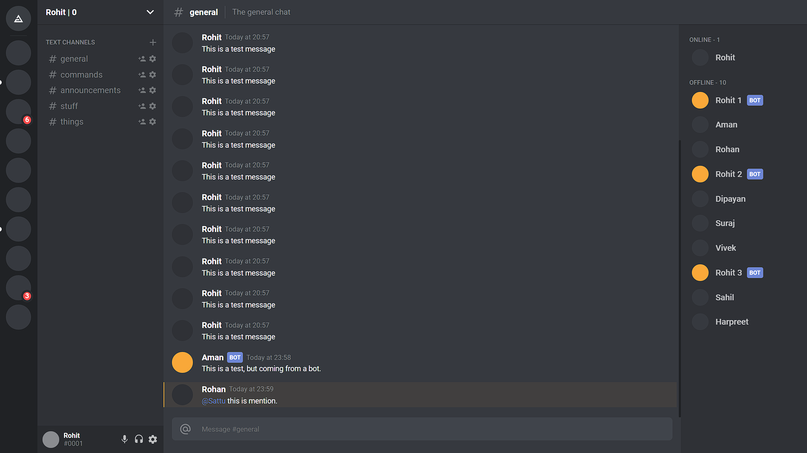

# Discord UI clone

Discord UI clone clone inspired by [Discord](https://discord.com)

## Discord UI

## Tech Stack used

### Frontend

   

### Backend

No backend required

## Developer

[Rohit Tewari](https://www.github.com/rtewari056)